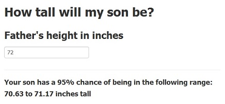

# The Height Calculator  
  
## A Shiny Application  
  
### by Bridget Thrasher

---

# Objective  

# This Shiny application predicts a son's height based on the height of his father  

* Simple, dynamic interface  
* Based on widely-used data  
* Returns 95% confidence interval

---

# Data

# The data used in this application were collected by Karl Pearson in 1903  

* 1,078 pairs of father and son heights  
* Linear regression model yields statistically significant relationship between the variables:  
     + p-value = `r summary(fit)$coef[2,"Pr(>|t|)"]` 

---

## Prediction Model Plot

# Linear regression (blue line) not 1:1 relationship (black line):  

```{r echo=FALSE,fig.height=5,fig.align='center'}
data(father.son)
qplot(fheight,sheight,data=father.son,xlab="Father",ylab="Son")+
     stat_smooth(method="lm")+
     geom_abline(intercept=0,slope=1)+
     theme(plot.margin=unit(c(0,0,0,0),"mm"))
```

---

# Application Usage and Outcome

* Enter father's height in inches into the text box  
* Lower and upper bounds of 95% confidence interval of son's height prediction displayed  
  

